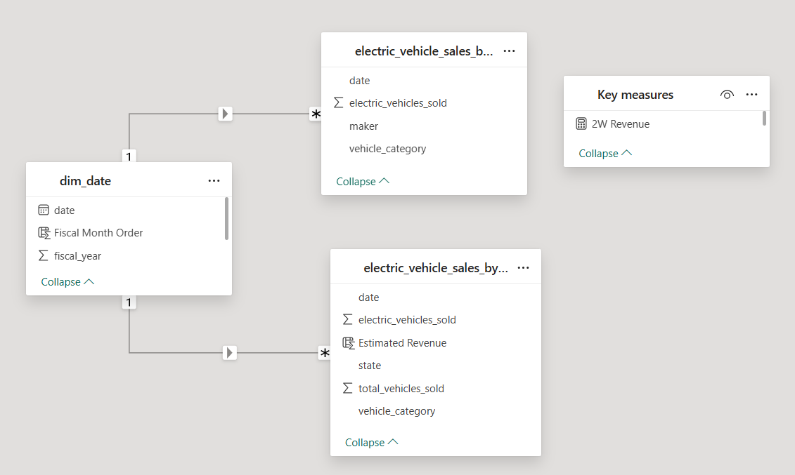
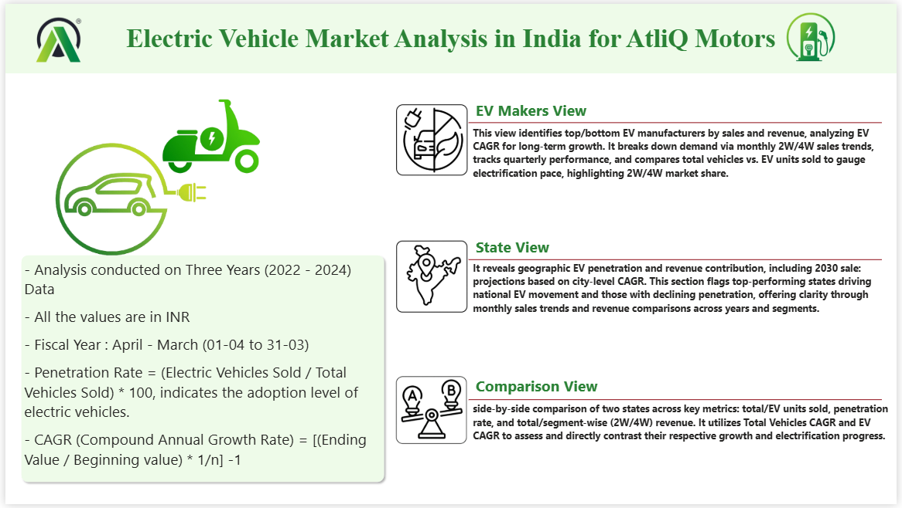
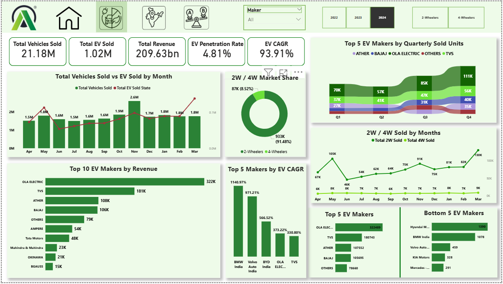
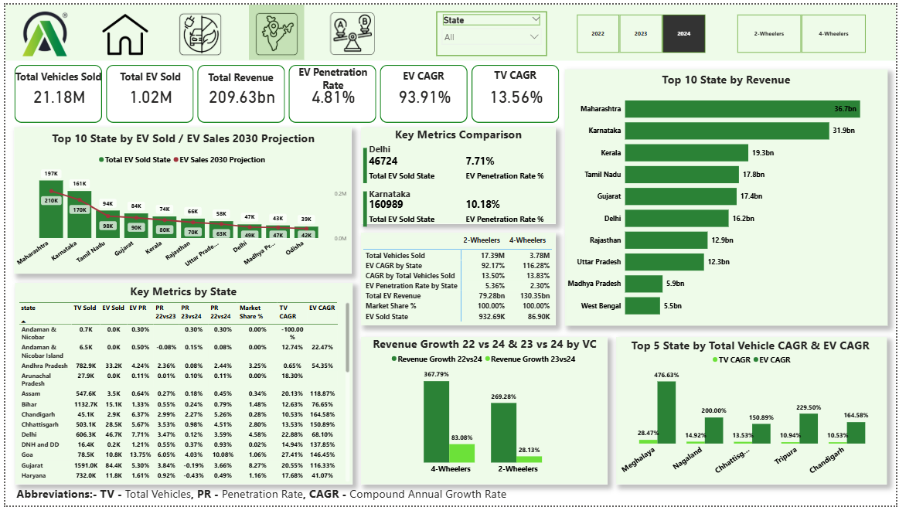
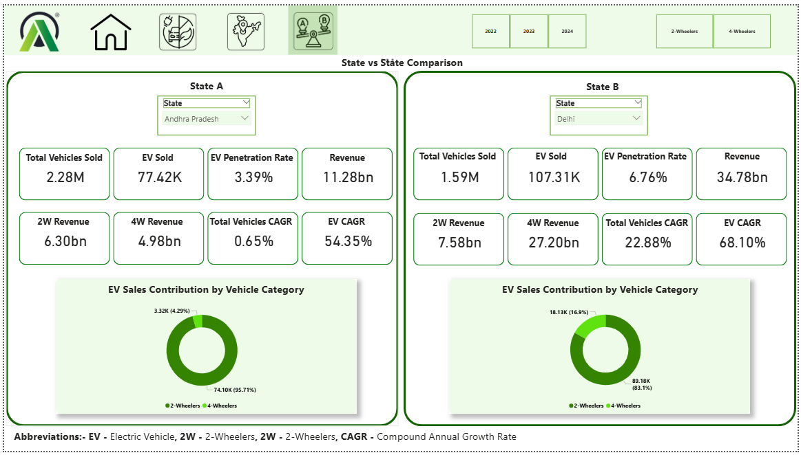

# 🚗 AtliQ-Motors-EV-Sales-Analysis

AtliQ Motors is an automotive giant from the USA specializing in electric vehicles (EV). In the last 5 years, their market share rose to 25% in electric and hybrid vehicles segment in North America. As a part of their expansion plans, they wanted to launch their bestselling models in India where their market share is less than 2%. Bruce Haryali, the chief of AtliQ Motors India wanted to do a detailed market study of existing EV/Hybrid market in India before proceeding further. Bruce gave this taskto the data analytics team of AtliQ motors and Peter Pandey is the data analyst working in this team.

## 🔍 Project Focus — What This Analysis Solves

- Study the current EV & Hybrid vehicle market in India to support AtliQ Motors’ expansion.
- Analyze market size, growth trends, and regional adoption patterns across states & major cities.
- Evaluate competition, including top-selling models, pricing, features, and market share.
- Identify customer segments, buying behaviour, and key factors influencing EV adoption.
- Assess charging infrastructure availability, density, and gaps across India.
- Estimate demand & forecast potential sales for AtliQ’s upcoming EV models.
- Determine optimal launch cities based on market potential, income, EV penetration, and charger density.
- Perform pricing analysis & willingness-to-pay estimation for AtliQ models.
- Provide data-driven go-to-market strategy including distribution, partnerships, and pilot launch approach.
- Highlight risks, challenges, and assumptions affecting market entry decisions.

## Key Terms to Know Before Dive Into the Dashboard :

### 📌 CAGR (Compound Annual Growth Rate)

#### 1️⃣ What is CAGR?

CAGR (Compound Annual Growth Rate) measures the average yearly growth of a value (such as EV sales, revenue, or market size) over a period of time — assuming it grows at a constant rate.

#### 2️⃣ Why is it used?

CAGR is used to understand long-term growth trends, eliminating year-to-year volatility.

It helps evaluate:

- Market growth (EV adoption over years)
- Company performance vs. industry
- Future forecasting

#### 3️⃣ How does it give valuable insights?

CAGR helps determine:

- Whether EV vehicle adoption is accelerating or slowing
- If the company is growing faster than the market
- Long-term sustainability of EV demand

It gives a clear, stable indicator of overall growth over multiple years.

#### 4️⃣ Which is better: high or low CAGR?

**High CAGR → Good for EV market growth**

Indicates strong demand, innovation, and rapid adoption.

**Low CAGR → Slow market expansion**

Shows stagnation or low consumer adoption.

📌 Higher CAGR is better for EV industry growth.

#### 5️⃣ Formula :

**CAGR = ((Ending Value / Beginning Value)^(1 / Number of Years) - 1) * 100**

### 📌 Penetration Rate

#### 1️⃣ What is Penetration Rate?

Penetration Rate measures the percentage of the total market that has adopted EV vehicles.

#### 2️⃣ Why is it used?

It helps understand how deeply EVs have entered the overall automobile market, by comparing EV users vs. total vehicle users.

Used for:

- Market sizing
- Understanding adoption levels
- Identifying early-stage vs mature EV markets

#### 3️⃣ How does it give valuable insights?

Penetration rate helps identify:

- Cities/regions with high EV adoption
- Where marketing or infrastructure investment is needed
- Growth opportunities in low-penetration areas

It is essential for deciding charging station expansion, city-level marketing, and EV subsidies strategy.

#### 4️⃣ Which is better: high or low penetration?

**High Penetration Rate → Good for EV industry maturity**

Indicates strong adoption and greater acceptance.

**Low Penetration Rate → Growth opportunity**

Shows market potential but slow adoption.

✔ For a company, high penetration = achieved success

✔ For growth potential, low penetration = more room to expand

#### 5️⃣ Formula :

**Penetration Rate (%) = (Total EV Sold / Total Vehicle Sold) * 100**

**Analysis was conducted on three years (2022 - 2024) data**

**Fiscal Year period for the AtliQ Motors is from April - March**

# Key Insights Summary :

## 🔷 Maker View – 2-Wheeler EV Market

### Market Leadership Trends :

- 2022: Hero Electric (69K), Okinawa (48K), Ampere (26K) leads / Jitendra (3.9K) ranks lowest.
- 2023: Ola Electric surges to 153K, becoming the new leader, followed by Okinawa and Hero Electric.
- 2024: Ola Electric dominates with 322K, followed by TVS (181K) and Ather (108K).
- Hero Electric, a leader in 2022, fails to remain in the top 5 from 2023 onward.

### Revenue Highlights :

- 2022 Leaders: Hero Electric (₹5.9B), Okinawa (₹4.1B), Ampere (₹2.2B).
- 2023 Leaders: Ola Electric (₹13B), Okinawa (₹8.2B), Hero Electric (₹7.6B).
- 2024 Leaders: Ola Electric (₹27B), TVS (₹15B), Ather (₹9B).

### Growth Momentum (CAGR) :

- Top 5 by CAGR: Ola Electric (373%), TVS (331%), Bajaj (285%), Ather (132%), Others (78%).
- Strong CAGR reflects aggressive market expansion, especially by Ola, TVS, and Bajaj.

### Quarterly Observations :

- Q4 is the strongest quarter every year.

## 🔷 Maker View – 4-Wheeler EV Market

### Market Leadership Trends

- 2022–2024: Tata Motors consistently leads with substantial sales growth : 2022 (13K) → 2023 (28K) → 2024 (48K).
- Mahindra remains the second-largest seller across all years.
- MG Motors holds third position steadily.

### Revenue Highlights

- 2022–2024: Tata Motors dominates revenue across all years (₹19B → ₹42B → ₹72B).
- Mahindra shows strong revenue growth from ₹6B (2022) to ₹35B (2024).

### Growth Momentum (CAGR) – Interesting Pattern

- Top 5 CAGR makers: BMW India (1141%), Volvo Auto India (971%), BYD India (567%), Hyundai (255%), Mercedes-Benz (234%).
- Despite high growth percentages, their absolute sales remain small, showing niche/low-volume premium EV markets.

### Quarterly Observations

- Tata Motors leads in almost all quarters except 2024 Q1, where Mahindra briefly overtakes with 11K sales.
- Mahindra’s strong Q1 is followed by a significant drop, reaching only 2K in Q4.

## 🔷 Combined 2W + 4W Monthly Trends

### Peak Months:

- 2022 & 2023: March
- 2024: March & May

4-Wheelers : Shows linear Sales Trend no fluctuation and big jump during 2022 - 2024, in March 2024 they reach the maximum limit of just 9k while at the same 2-wheelers are aggresively cover the market with 130k units sold

## 🔷 State View – EV Market Performance

### Top States by Sales & Revenue

- Maharashtra & Karnataka dominate both 2W and 4W segments in sales and revenue contribution.
- These two states are consistently at the top across all categories.

### Top states by penetration rate

#### 2023

**2W :**
- Goa(12.5%)
- Delhi(9.5%)
- Karataka(9.2%)
- Kerala(8.4%)
- Maharastra(8.2%)

**4W :**
- Delhi(3.7%)
- Goa(3.2%)
- Maharastra(2.6%)
- Kerala(2.4%)
- Karnataka(2.1%)

#### 2024

**2W :**
- Goa(18%)
- Kerala(13.5%)
- Karnataka(11.6%)
- Maharastra(10.1%)
- Delhi(9.4%)

**4W :**
- Kerala(5.8%)
- chandigarh(4.5%)
- Delhi(4.3%)
- karnataka(4.3%)
- Goa(4.3%)

### 2030 Sales Forecasting

- 4-Wheeler: Uttar Pradesh projected highest (437.96M), driven by highest CAGR (561%).
- 2-Wheeler: Maharashtra projected highest (15.26M) due to strong past performance.

### Revenue Growth (YoY Comparison)

#### 2022 → 2024:

- 2W: +269%
- 4W: +367%

#### 2023 → 2024:

- 2W: +28%
- 4W: +83%

### Top States by EV CAGR

#### 2-Wheelers:

- Tripura (212%)
- Goa (160%)
- Chandigarh (154%)
- Chhattisgarh (148%)
- West Bengal (149%)

#### 4-Wheelers:

- Uttar Pradesh (561%)
- Assam (447%)
- Punjab (383%)
- Haryana (374%)
- Odisha (227%)

#### Overall (2W+4W):

- Meghalaya (476%)
- Nagaland (200%)
- Tripura (229%)
- Chandigarh (165%)
- Chhattisgarh (151%)

### Declining Penetration States

#### 2022 → 2023:

- Andaman & Nicobar Islands

#### 2023 → 2024:

- Gujarat
- Haryana
- Himachal Pradesh
- Rajasthan
- Jharkhand
- Uttarakhand

Indicates shrinking EV adoption pace in these regions.

# 📌 Quick Summary Insights (2022–2024 EV Market Performance)

### 1️⃣ Overall Market Size

- 2-Wheelers dominate the EV market with 47 million total sales, significantly higher than 4-Wheelers (10 million).

### 2️⃣ Growth Momentum (CAGR)

#### EV CAGR by State

- 4-Wheelers have a higher EV CAGR (116.28%) compared to 2-Wheelers (92.17%),
- indicating faster expansion in the premium/4W market across states.

Although 4W volumes are lower, their growth trajectory is stronger, revealing rising consumer interest in long-range and high-performance EVs.

#### CAGR by Total Vehicles Sold

CAGR is nearly the same for both:

- 2W: 13.50%
- 4W: 13.83%

This shows stable and consistent growth across the entire EV ecosystem without extreme fluctuations.

### 3️⃣ EV Penetration Rate

- 2-Wheelers: 4.08% penetration
- 4-Wheelers: 1.48% penetration

➡️ 2W EVs penetrate the market 3× more than 4W EVs.

This aligns with India’s price-sensitive consumer base, where 2W EVs are adopted faster due to lower cost and daily commuting needs.

### 4️⃣ Revenue Contribution

- 4-Wheelers generate more revenue (₹229.41Bn) than 2W (₹162.62Bn) despite lower unit sales.

Highlights:

- Higher price per unit
- Higher margins
- Stronger profitability per customer in the 4W segment

👉 For automakers, 4-wheelers = high-value segment, while 2-wheelers = high-volume segment.

### 5️⃣ Market Share

- 2-Wheelers hold an overwhelming 92.6% market share of overall EV sales.
- 4-Wheelers account for only 7.4%.

This reflects India’s current EV maturity:

- Mass adoption → 2W segment
- Emerging adoption → 4W segment but with huge future potential

### 6️⃣ EV Sales by State

- 2-Wheelers: 1,913.2K (1.9M)
- 4-Wheelers: 152.9K

difference shows:

- EV adoption is deeply driven by 2W-friendly states (Maharashtra, Karnataka, Tamil Nadu, Gujarat).
- 4W EV adoption is still limited to high-income or urban states but is slowly expanding.

# 📌 Final Summary :

India’s EV market is experiencing rapid and consistent growth, led by strong adoption in both 2W and 4W categories.

2-Wheelers dominate in volume, driven by affordability and daily-use mobility.

4-Wheelers show faster CAGR with significantly higher revenue per vehicle, indicating a high-value, early-stage premium growth opportunity.

### Market leaders:

- Ola Electric → 2W category
- Tata Motors → 4W category

High-growth states such as Uttar Pradesh, Tripura, and Meghalaya demonstrate strong demand acceleration and future potential.

Core markets like Maharashtra and Karnataka continue to be the revenue and volume backbone for India’s EV sector.

Seasonality trends indicate demand peaks in March, with Q4 being the strongest quarter for EV sales.

India’s EV ecosystem is evolving, offering AtliQ Motors strategic opportunities across both high-volume (2W) and high-value (4W) segments.

# Dashboard View :

### Live Dashboard Link : Click Here

# Data Model View :

# Home Page View :

# Maker Page View :

# State Page View :

# State vs State Page View :

# 🛠️ Tools Used

- Power BI
- DAX
- Power Query
- Excel
- Data Modeling
- Data Visualization

---

# 👨‍💻 Authoe

**Siya Halarnkar**

Data Analyst | Power BI Developer | SQL Enthusiast
